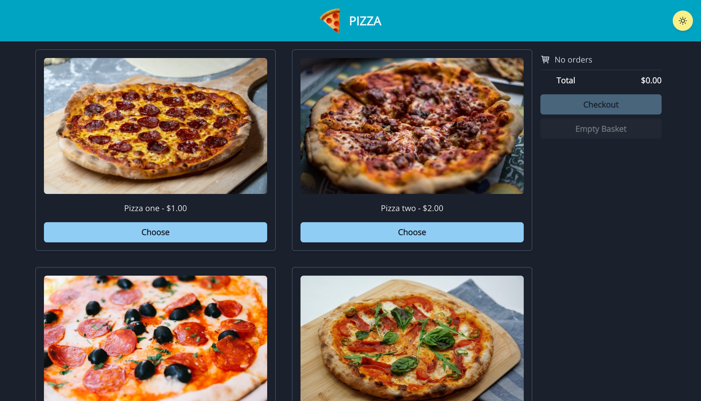
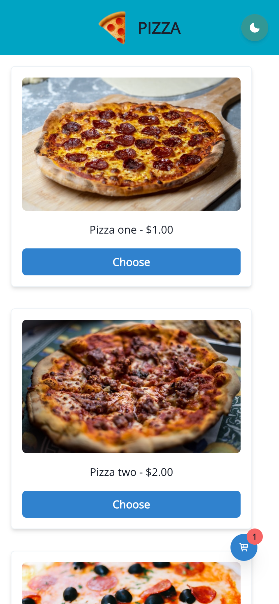

# pizza

A pizza store application.

|            Desktop            |           Mobile             |
|-------------------------------|------------------------------|
|  |  |

## Getting started

Node v14+ and Yarn v1 should be installed on the development machine. Install project dependencies with: `$ yarn install`

Runnable commands for each packages can be found in `package.json#scripts`

To start development server to serve the webpage, run: `$ yarn workspace @pizza/app start` and open browser at `localhost:1234`

To start storybook server for UI development, run: `$ yarn workspace @pizza/ui start` and open browser at `localhost:6006`

## Project Structure

The project is divided into multiple packages and managed with Yarn Workspaces.   
This separates code into layers and define clear responsibility boundaries. For example, the `ui` package contains standalone react components, and the `frontend` package acts as a shell and wraps the components into pages.   
Defining clear boundaries allows the code to be tested and refactored more easily, and the benefits are more visible in the long run, where the project grows in size and perhaps need to be refactored into a more advanced architecture like microfrontends to fit the growing business needs.

## State Management

Redux is used to maintain the application state. React state can only be passed down from parent components to child components, and state that are shared by sibiling components must be hoisted to an ancestor component. Redux takes an alternative approach by hoisting application state into a single store, and implements an observer pattern that allows components to subscribe to state changes.

Changes that should be propagated from the component to the redux store is done with actions, which this project has divided into two categories.   
Command actions occurs when the user performs some input, which starts off a chain of reactions. They are dispatched from the application code directly.   
Document actions occurs in resopnse to command actions, and denote a change in state, meaning that there is a reducer handling the document actions. They are dispatched inside middlewares.   
For a more complicated application, it is possible to include a third category of actions, which are event actions. Event actions occurs in response to command actions, or other event actions, and are dispatched inside middlewares. The difference between document actions and event actions is that event actions does not changes state of the redux store, and describes that only something not originated from the user has occurred for middlewares to react to.

By separating actions into multiple categories, the flow of state changes becomes clear and easy to reason. Logging can also be done in a cleaner manner since a logging middleware can just drop all document actions with a simple filter for instance.

## Styling

The majority of styling is done with style props offered by Chakra UI, which uses Emotion under the hood.   
Using this approach instead of going with the more traditional stylesheets increases productivity and promotes refactoring, since styling is closely located with the markup. The philsophy of co-locating markup and styling information is also implemented by pure css libraries such as [tailwindcss](https://tailwindcss.com/), which is also a great library implementing atomic styling, but not picked in this project due to overlapping functionality with what Chakra UI offers.

Responsiveness is usually achieved with css media queries. This project takes an alternative approach by leveraging what Chakra UI offers [out of the box](https://chakra-ui.com/docs/features/responsive-styles). Chakra UI can generate media queries with Emotion while providing an abstraction through React component props. It is also possible to use to use React hooks to calculate values dynamically based on [breakpoints](https://chakra-ui.com/docs/hooks/use-breakpoint-value).

The techniques used to achieve responsiveness for this project includes css grid and breakpoint hooks from Chakra UI. The attribute `grid-template-rows` is set to `repeat(auto-fill, minmax(...))` to achieve a responsive grid which automatically fills up the available screen width with cells of a maximum size. Breakpoint hooks is used to switch between displaying desktop and mobile views for the basket.

Browser support for this [css grid](https://caniuse.com/mdn-css_properties_grid-template-rows_repeat) feature is broad, and fulfills the requirements of supporting latest version of Chrome.

Dark mode support is added to this project since Chakra UI supports this with its theming API and comes with great defaults. Under the hood, css custom properties are used to switch values between colour modes. For components that are not covered by Chakra UI, its React hook API is used to switch between values for different colour modes.

While the approach of using css-in-js comes with a penalty at both bundle size and runtime computations, the impacts caused by such are often negligible for most static applications, such as this project, making the tradeoff worthwhile. However, the methodology for styling is a highly debatable subject, and should be picked based on team preferences after considering the potential performance impacts.

## Approach to Testing

While this project has relatively simple requirements, the code is structured in a fully testable manner.

**Redux state management**  
Redux describes the state of an application with an immutable JavaScript object, which determines how the application looks and acts at a particular point in time. All changes to the redux state are done with reducers, which are pure functions and highly testable. The side effects are isolated with middlewares, which has the dependencies injected into it. [Here](https://github.com/lokshunhung/connected-react-router-lite) is an example on how the aforementioned parts can be tested. By hoisting application state into the redux store from components, the components has a clearer responsibility boundary and can be converted into a stateless presentation component most of the time.

**Snapshot testing**  
Creating snapshots of a result from a function given certain inputs. Very cheap to implement using Jest's `expect` library. This can be applied on React components as well, by snapshotting the DOM structure output of components given particular props as input.

**Presentational components**  
By separating presentational components from container components (also called dumb components/smart components), the output depends entirely on the props, and the component is agnostic on how state is managed.

**Storybook**  
This projects uses Storybook to manage the component library, acting as a live documentation, and allows the possibility of various testing methods to be implemented. One example of such is [visual regression testing](https://storybook.js.org/docs/react/workflows/visual-testing) is done by creating visual snapshots of UI components, and comparing if they are different from previous snapshots, which can be implemented with [Chromatic](https://www.chromatic.com/).

**Unit testing**  
Unit tests covers a piece of functionality in isolation. This can be applied on utility functions such as those inside `@pizza/utils`, and type definitions like [this](https://github.com/lokshunhung/leetypescript/blob/master/src/objects/deep-pick.typetest.ts), and React components with the aid of libraries like `@testing-library/react`.

## Choice of tech stack

React - UI framework

Project requirement.

Chakra UI - UI components library

Chakra UI implements the atomic css design philosophy with style props, simplifying the process of styling and offering type safety.   
It also has a rich collection of UI components with great documentation.   
Other popular choices for React UI components library are Ant Design, Material UI, but they are less flexible when it comes to customization from my experience.

Redux - state management library

Redux has a long history and has become the defacto state management library.   
It emphasizes the concept of single directional dataflow and immutability so the application state can be reasoned easily.   
There are a wide range of tools in the community that grants superpowers with redux, such as <a href="https://chrome.google.com/webstore/detail/redux-devtools/lmhkpmbekcpmknklioeibfkpmmfibljd?hl=en">Redux DevTools</a> which offers time travelling debugging, and various asynchronous middlewares like <a href="https://redux-saga.js.org/">Redux Saga</a> and <a href="https://redux-observable.js.org/">Redux Observable</a>.   
In this code challenge I have opted to not use any of these since code based on these libraries requires a learning curve before they can be comprehended easily, which is not ideal for code challenges where deep understanding of the underlying concepts are supposed to be demonstrated rather than relying on these libraries.

Storybook - UI development & documentation

Storybook is a tool to facilitate developing UI components in isolation. Users create stories, which are interactive demos of UI components. It is a valuable tool particularly in a team setting, where multiple developers would work on the UI in isolation.   
It can also be used to generate documentation and <a href="https://storybook.js.org/docs/react/workflows/visual-testing">visual regression testing</a>, but these are not used in this challenge and could be an improvement to be made.

Parcel - build tool (bundler)

Parcel is a modern build tool which transpiles and bundles JavaScript, stylesheets, and perform minification for frontend assets.   
It is very easy to configure since it has great defaults out-of-the-box. I have chosen this build tool due to the ease of setting up and my experience of using parcel on both work and personal projects had been very positive.   
A popular alternative is webpack, which is highly customizable but is more difficult to configure due to its historical baggage. It is used under the hood by storybook.

## Improvements

The redux store implementation can be simplified with tools like `redux-observable`, which would allow the middlewares to be tested with declarative [rxjs marble tests](https://rxjs.dev/guide/testing/marble-testing). Logging can be added to this library using the redux middleware API, and aggregated with Kibana.

The choice of using Parcel as the bundler can also be switched to webpack. This change will mean that both the ui package powered by storybook and the web application itself uses the same bundler. It would also be easier to setup a more powerful build tool such as [bazel](https://github.com/lokshunhung/bazel-ts-monorepo) to orchestrate incremental builds.

Form management also be abstracted with additional libraries like [react-hook-form](https://react-hook-form.com/). It is a highly debated subject on whether form state should live outside the redux store, with performance issue as one of the concern. But since this project is relatively simple, the effects of such are negligible.
